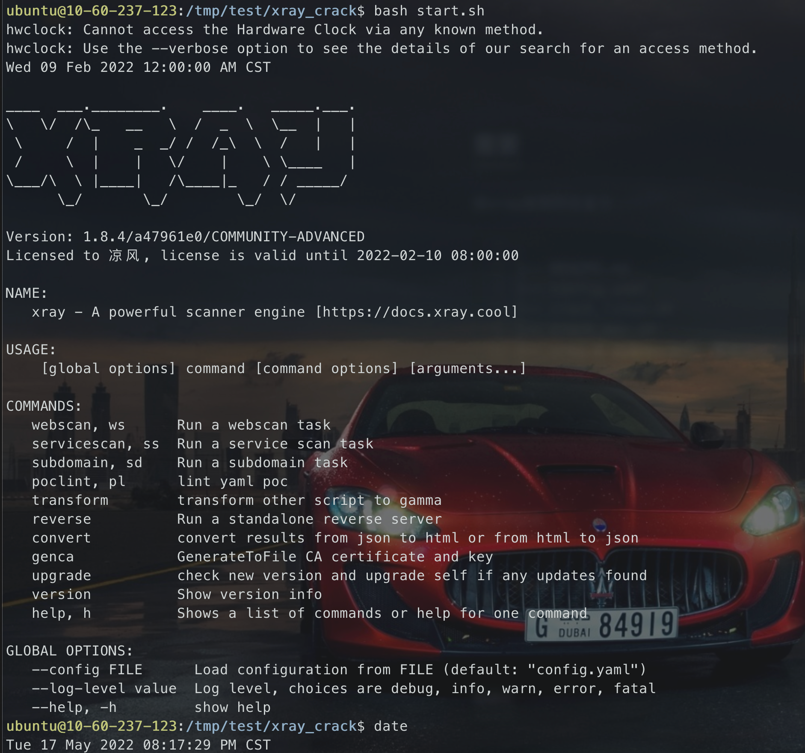

原理都一样，但是看到的几乎都是windows的，所以写了个简单的shell脚本来解决linux和mac的适配问题

## 需要

给xray放到同目录下

```
.
├── README.md
├── config.yaml
├── crack_linux.sh
├── crack_mac.sh
├── xray # 这是mac版的，需要就替换成linux版
└── xray-license.lic
```


## linux

```shell
bash crack_linux.sh args
```



## mac

```shell
bash crack_mac.sh args
```

* 使用前需要安装htpdate `brew install htpdate`


## 参考

* https://github.com/TryHello/xray_free_crack.git
